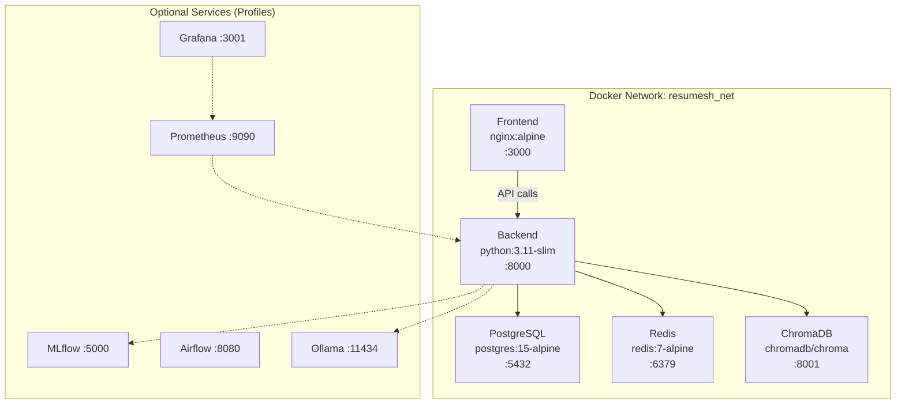

# 🐳 ResuMesh — Docker Guide

Production-ready Docker setup for the ResuMesh AI-powered resume analysis platform.

---

## Prerequisites

| Tool | Minimum Version | Check Command |
|---|---|---|
| Docker Engine | 24.0+ | `docker --version` |
| Docker Compose | V2 (built-in) | `docker compose version` |
| Git | 2.30+ | `git --version` |

> [!TIP]
> Docker Desktop (Windows/macOS) includes both Docker Engine and Compose V2.

---

## Quick Start

```bash
# 1. Clone the repository
git clone https://github.com/Aryansingh-ai/ResuMesh.git
cd ResuMesh

# 2. Create environment file
cp .env.example .env
# Edit .env with your actual values (API keys, secrets, etc.)

# 3. Build and start all core services
docker compose up --build
```

That's it! The application will be available at:

| Service | URL | Description |
|---|---|---|
| **Frontend** | http://localhost:3000 | React Dashboard |
| **Backend API** | http://localhost:8000 | FastAPI REST API |
| **API Docs** | http://localhost:8000/docs | Swagger UI (dev only) |
| **PostgreSQL** | localhost:5432 | Database |
| **Redis** | localhost:6379 | Cache |
| **ChromaDB** | localhost:8001 | Vector Database |

---

## Architecture



---

## Docker Compose Profiles

The services are organized into **profiles** so you only run what you need:

```bash
# Core services only (postgres, redis, chromadb, backend, frontend)
docker compose up --build

# Core + ML tools (MLflow, Airflow)
docker compose --profile ml up --build

# Core + Self-hosted LLM (Ollama)
docker compose --profile llm up --build

# Core + Monitoring (Prometheus, Grafana)
docker compose --profile monitoring up --build

# Everything at once
docker compose --profile full up --build
```

You can also combine profiles:

```bash
docker compose --profile ml --profile monitoring up --build
```

Or set profiles in your `.env` file:

```env
COMPOSE_PROFILES=ml,monitoring
```

---

## Development vs Production

### Development Mode (Default)

When you run `docker compose up`, the `docker-compose.override.yml` is **automatically loaded**, providing:

- 🔄 **Hot Reload**: Backend uses `--reload`, frontend uses Vite HMR
- 📁 **Volume Mounts**: Source code is mounted into containers — edit locally, see changes instantly
- 🐛 **Debug Mode**: `DEBUG=true` enables Swagger docs and verbose logging
- 💾 **Relaxed Limits**: More memory allocated for development

```bash
# Development mode (auto-loads override)
docker compose up --build
```

### Production Mode

To run in production (skip the override file):

```bash
# Production mode (explicit file, no override)
docker compose -f docker-compose.yml up --build -d
```

Production mode provides:
- 🏗️ **Multi-stage builds**: Smaller, optimized images
- 🔒 **Non-root user**: Backend runs as `appuser` (UID 1000)
- 🚀 **nginx**: Frontend served by nginx instead of Vite dev server
- 📊 **Resource limits**: Memory caps to prevent runaway processes
- ⚡ **Multi-worker**: Backend runs 4 uvicorn workers

---

## Environment Variables

All configuration is loaded from the `.env` file. Key variables:

### Application

| Variable | Default | Description |
|---|---|---|
| `APP_ENV` | `development` | Environment name |
| `DEBUG` | `true` | Enable debug mode |
| `SECRET_KEY` | — | Application secret (change in production!) |

### Database

| Variable | Default | Description |
|---|---|---|
| `POSTGRES_DB` | `resumesh` | Database name |
| `POSTGRES_USER` | `resumesh_user` | Database user |
| `POSTGRES_PASSWORD` | — | Database password |
| `DATABASE_URL` | — | Full connection string |

### Authentication

| Variable | Default | Description |
|---|---|---|
| `JWT_SECRET_KEY` | — | JWT signing key |
| `JWT_ALGORITHM` | `HS256` | JWT algorithm |
| `ACCESS_TOKEN_EXPIRE_MINUTES` | `30` | Token TTL |

### LLM

| Variable | Default | Description |
|---|---|---|
| `LLM_PROVIDER` | `ollama` | `ollama`, `groq`, or `gemini` |
| `OLLAMA_MODEL` | `llama3.2` | Ollama model name |
| `GROQ_API_KEY` | — | Groq API key (if using Groq) |
| `GOOGLE_API_KEY` | — | Google API key (if using Gemini) |

### Docker

| Variable | Default | Description |
|---|---|---|
| `COMPOSE_PROFILES` | — | Comma-separated profiles to activate |
| `DOCKER_BUILDKIT` | `1` | Enable BuildKit for faster builds |
| `VITE_API_URL` | `http://localhost:8000` | Frontend API endpoint |

See [.env.example](file:///c:/Users/aryan/OneDrive/Documents/PROJECTS/ResuMesh/.env.example) for the complete list.

---

## Common Docker Commands

### Service Management

```bash
# Start services (detached)
docker compose up -d --build

# Stop all services
docker compose down

# Restart a specific service
docker compose restart backend

# View running containers
docker compose ps
```

### Logs

```bash
# Tail all logs
docker compose logs -f --tail=100

# Logs for a specific service
docker compose logs -f backend

# Logs since a timestamp
docker compose logs --since "2024-01-01T00:00:00" backend
```

### Shell Access

```bash
# Open shell in backend container
docker compose exec backend bash

# Open shell in frontend container
docker compose exec frontend sh

# Run a one-off command
docker compose exec backend python -c "from app.core.config import settings; print(settings.APP_ENV)"
```

### Database

```bash
# Open PostgreSQL shell
docker compose exec postgres psql -U resumesh_user -d resumesh

# Run migrations
docker compose exec backend alembic upgrade head

# Create a new migration
docker compose exec backend alembic revision --autogenerate -m "add new table"
```

### Build & Cleanup

```bash
# Rebuild without cache
docker compose build --no-cache

# Remove stopped containers
docker compose down

# Remove containers AND volumes (⚠️ deletes data!)
docker compose down -v

# Prune unused Docker objects
docker system prune -a --volumes
```

---

## Multi-Stage Build Details

### Backend Dockerfile

```
┌─────────────────────────────┐
│  Stage 1: builder           │
│  - python:3.11-slim         │
│  - Install build deps       │
│  - Create virtualenv        │
│  - pip install requirements │
│  - Pre-download ML model    │
└──────────┬──────────────────┘
           │
┌──────────▼──────────────────┐
│  Stage 2: production        │
│  - python:3.11-slim (clean) │
│  - Copy virtualenv only     │
│  - Non-root user (appuser)  │
│  - 4 uvicorn workers        │
└──────────┬──────────────────┘
           │
┌──────────▼──────────────────┐
│  Stage 3: development       │
│  - Extends production       │
│  - uvicorn --reload         │
│  - Source volume-mounted     │
└─────────────────────────────┘
```

### Frontend Dockerfile

```
┌─────────────────────────────┐
│  Stage 1: deps              │
│  - node:20-alpine           │
│  - npm ci (cached layer)    │
└──────────┬──────────────────┘
           │
┌──────────▼──────────────────┐
│  Stage 2: builder           │
│  - Vite production build    │
│  - Build-time env vars      │
└──────────┬──────────────────┘
           │
┌──────────▼──────────────────┐
│  Stage 3: production        │
│  - nginx:1.27-alpine (~25MB)│
│  - SPA routing, gzip,       │
│    security headers         │
└─────────────────────────────┘

┌─────────────────────────────┐
│  Stage 4: development       │
│  - node:20-alpine           │
│  - Vite dev server + HMR    │
│  - Source volume-mounted     │
└─────────────────────────────┘
```

---

## Troubleshooting

### Port Conflicts

```
Error: Bind for 0.0.0.0:8000 failed: port is already allocated
```

**Solution**: Stop the conflicting process or change the port in `.env`:

```bash
# Find what's using the port (Linux/macOS)
lsof -i :8000

# Find what's using the port (Windows)
netstat -ano | findstr :8000

# Kill the process
kill <PID>           # Linux/macOS
taskkill /PID <PID>  # Windows
```

### Build Failures

```
Error: failed to solve: python:3.11-slim: error getting credentials
```

**Solution**: Log in to Docker Hub:

```bash
docker login
```

### Out of Memory

```
Container killed: OOM
```

**Solution**: Increase Docker's memory allocation in Docker Desktop Settings → Resources, or reduce container limits in `docker-compose.yml`.

### Backend Can't Connect to Database

```
sqlalchemy.exc.OperationalError: connection refused
```

**Solution**: Ensure PostgreSQL is healthy before backend starts. The `depends_on` + `healthcheck` should handle this automatically. If issues persist:

```bash
# Check postgres health
docker compose ps postgres
docker compose logs postgres

# Restart with fresh volumes
docker compose down -v
docker compose up --build
```

### Frontend Shows Blank Page

**Solution**: Ensure `VITE_API_URL` in `.env` matches your backend URL. In development, it should be `http://localhost:8000`.

### Slow Builds

**Solution**: Enable BuildKit for parallel builds:

```bash
export DOCKER_BUILDKIT=1
docker compose build
```

---

## File Structure

```
ResuMesh/
├── docker/
│   ├── Dockerfile.backend    # Multi-stage FastAPI image
│   ├── Dockerfile.frontend   # Multi-stage React + nginx image
│   ├── Dockerfile.airflow    # Apache Airflow image
│   └── nginx.conf            # Frontend nginx configuration
├── docker-compose.yml        # Production compose (all services)
├── docker-compose.override.yml # Dev overrides (hot reload)
├── backend/.dockerignore     # Backend build exclusions
├── frontend/.dockerignore    # Frontend build exclusions
├── .env                      # Environment variables (not in Git)
└── .env.example              # Environment template
```
