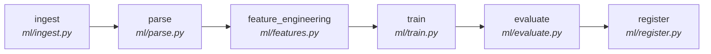

# 📦 ResuMesh — DVC (Data Version Control) Guide

DVC manages versioning of datasets, model artifacts, and ML pipeline reproducibility for the ResuMesh project.

---

## What is DVC?

[DVC (Data Version Control)](https://dvc.org/) is an open-source tool that brings Git-like version control to data and ML models. It works alongside Git:

- **Git** tracks code, configs, and `.dvc` metadata files
- **DVC** tracks large data files, datasets, model weights, and embeddings

Think of it as "Git for data" — you get versioning, branching, and collaboration for files that are too large for Git.

---

## Why We Use DVC in ResuMesh

| Problem | DVC Solution |
|---|---|
| Datasets are too large for Git | DVC stores data externally, Git tracks only lightweight `.dvc` pointers |
| Can't reproduce ML experiments | DVC pipelines ensure reproducible end-to-end ML workflows |
| No way to version model artifacts | Every model version is tracked and restorable |
| Team members need the same data | `dvc pull` fetches exact data from shared remote storage |
| "Which data trained this model?" | DVC links data versions to code versions via Git commits |

---

## Project Data Structure

```
ResuMesh/
├── .dvc/                          # DVC configuration (auto-generated)
│   └── config                     # Remote storage settings
├── .dvcignore                     # Files DVC should ignore
├── dvc.yaml                       # ML pipeline definition (stages)
├── dvc.lock                       # Pipeline lock file (auto-generated)
│
├── data/                          # Pipeline-managed data (via dvc.yaml)
│   ├── raw/                       # Raw ingested data (resumes, jobs, feedback)
│   └── processed/                 # Processed features and training data
│
├── datasets/                      # DVC-tracked standalone datasets
│   ├── sample_resumes/            # Sample resumes for testing
│   │   └── sample_resumes.dvc     # DVC tracking file
│   └── evaluation/                # Evaluation/benchmark datasets
│       └── evaluation.dvc         # DVC tracking file
│
├── artifacts/                     # DVC-tracked ML artifacts
│   └── embeddings/                # Locally stored embeddings
│       └── embeddings.dvc         # DVC tracking file
│
├── models/                        # Pipeline-managed model artifacts
│   └── match_model.pkl            # Trained matching model
│
└── dvc-remote/                    # Local DVC remote storage (gitignored)
```

### How Data is Organized

| Directory | Managed By | Purpose |
|---|---|---|
| `data/raw/` | DVC Pipeline (`dvc.yaml`) | Raw data from ingestion stage |
| `data/processed/` | DVC Pipeline (`dvc.yaml`) | Processed features for training |
| `models/` | DVC Pipeline (`dvc.yaml`) | Trained model artifacts |
| `datasets/sample_resumes/` | DVC (`dvc add`) | Sample resumes for testing |
| `datasets/evaluation/` | DVC (`dvc add`) | Evaluation/benchmark data |
| `artifacts/embeddings/` | DVC (`dvc add`) | Locally stored embeddings |

---

## Quick Start

### 1. Install DVC

```bash
pip install dvc==3.51.2

# Or with specific remote support:
pip install "dvc[s3]"    # For AWS S3
pip install "dvc[gs]"    # For Google Cloud Storage
pip install "dvc[azure]" # For Azure Blob Storage
```

### 2. Pull Existing Data

After cloning the repo, pull tracked data from the remote:

```bash
# Pull all DVC-tracked data
dvc pull

# Pull specific file/directory
dvc pull datasets/sample_resumes.dvc
```

### 3. Check Status

```bash
# See what's changed
dvc status

# See what data is tracked
dvc data status
```

---

## Core Commands Reference

### Versioning Datasets

```bash
# Track a new file or directory
dvc add datasets/sample_resumes/

# This creates:
#   datasets/sample_resumes.dvc  → Git-tracked pointer file
#   datasets/.gitignore          → Auto-generated to prevent Git tracking the data

# Commit the tracking file to Git
git add datasets/sample_resumes.dvc datasets/.gitignore
git commit -m "data: add sample resumes dataset"

# Push data to remote storage
dvc push
```

### Restoring Datasets

```bash
# Pull all tracked data from remote
dvc pull

# Pull a specific dataset
dvc pull datasets/evaluation.dvc

# Restore data from a specific Git commit
git checkout <commit-hash> -- datasets/sample_resumes.dvc
dvc checkout
```

### Updating Datasets

```bash
# 1. Add/modify files in the tracked directory
#    e.g., add new resumes to datasets/sample_resumes/

# 2. Re-track the updated directory
dvc add datasets/sample_resumes/

# 3. Commit the updated .dvc file
git add datasets/sample_resumes.dvc
git commit -m "data: update sample resumes with 50 new entries"

# 4. Push updated data to remote
dvc push
```

### Pipeline Operations

The ML pipeline is defined in `dvc.yaml` with these stages:

```
ingest → parse → feature_engineering → train → evaluate → register
```

```bash
# Run the full pipeline
dvc repro

# Run a specific stage
dvc repro train

# Check pipeline status (what needs to re-run)
dvc status

# View pipeline DAG
dvc dag
```

### Remote Storage

```bash
# List configured remotes
dvc remote list

# Push data to remote
dvc push

# Pull data from remote
dvc pull

# Check remote status
dvc push --dry
```

---

## ML Pipeline Details

The pipeline is defined in [dvc.yaml](file:///c:/Users/aryan/OneDrive/Documents/PROJECTS/ResuMesh/dvc.yaml):



| Stage | Script | Inputs | Outputs |
|---|---|---|---|
| `ingest` | `ml/ingest.py` | — | `data/raw/*.json` |
| `parse` | `ml/parse.py` | `data/raw/*.json` | `data/processed/training_data.json` |
| `feature_engineering` | `ml/features.py` | `training_data.json` | `features.npz`, `feature_names.json` |
| `train` | `ml/train.py` | `training_data.json` | `models/match_model.pkl` |
| `evaluate` | `ml/evaluate.py` | `match_model.pkl` | `evaluation_report.json` |
| `register` | `ml/register.py` | `match_model.pkl` | — |

DVC automatically detects which stages need re-running based on file changes.

---

## Remote Configuration

### Current: Local Remote

The project is configured with a local filesystem remote:

```bash
$ dvc remote list
local    ./dvc-remote
```

This is suitable for solo development. The `dvc-remote/` directory is gitignored.

### Migrating to Cloud Storage

#### AWS S3

```bash
# Add S3 remote
dvc remote add -d s3remote s3://your-bucket/resumesh-data

# Configure credentials (or use AWS CLI profile)
dvc remote modify s3remote access_key_id YOUR_KEY
dvc remote modify s3remote secret_access_key YOUR_SECRET

# Push existing data
dvc push
```

#### Google Cloud Storage

```bash
# Add GCS remote
dvc remote add -d gcsremote gs://your-bucket/resumesh-data

# Push existing data
dvc push
```

#### Azure Blob Storage

```bash
# Add Azure remote
dvc remote add -d azureremote azure://your-container/resumesh-data
dvc remote modify azureremote account_name YOUR_ACCOUNT
dvc remote modify azureremote account_key YOUR_KEY

# Push existing data
dvc push
```

> [!TIP]
> Install the appropriate DVC extra for your cloud provider:
> ```bash
> pip install "dvc[s3]"   # AWS
> pip install "dvc[gs]"   # Google Cloud
> pip install "dvc[azure]" # Azure
> ```

---

## Best Practices

### 1. Always Commit `.dvc` Files with Code

When you update data, commit the `.dvc` file in the same Git commit as the code change. This ensures any Git checkout will have matching data pointers.

```bash
# Good: data and code changes together
git add datasets/sample_resumes.dvc ml/train.py
git commit -m "feat: add new training data and update model"
```

### 2. Push Data Before Pushing Code

```bash
dvc push         # Push data first
git push origin  # Then push code
```

If you push code without data, teammates will get `.dvc` pointer files but `dvc pull` will fail.

### 3. Use Meaningful Commit Messages

```bash
git commit -m "data: add 200 sample resumes for ATS testing"
git commit -m "model: retrain with updated feature engineering"
```

### 4. Review Pipeline Before Running

```bash
# Check what will run
dvc status

# View the DAG
dvc dag

# Dry run
dvc repro --dry
```

### 5. Tag Important Model Versions

```bash
git tag -a v1.0-model -m "Production model v1.0 - 92% accuracy"
git push origin v1.0-model
```

You can always restore this exact model:

```bash
git checkout v1.0-model
dvc checkout
```

### 6. Don't Track Temporary Files

Use `.dvcignore` to exclude build artifacts, caches, and IDE files from DVC tracking. The project's `.dvcignore` is pre-configured.

### 7. Keep Remote in Sync

```bash
# Check what's not pushed
dvc push --dry

# Check what's not pulled
dvc pull --dry
```

---

## File Reference

| File | Purpose |
|---|---|
| `.dvc/config` | DVC configuration (remotes, settings) |
| `.dvcignore` | Files/directories DVC should ignore |
| `dvc.yaml` | ML pipeline stage definitions |
| `dvc.lock` | Locked pipeline state (auto-generated) |
| `*.dvc` | Data tracking pointer files (commit to Git) |
| `dvc-remote/` | Local remote storage (gitignored) |

---

## Troubleshooting

### `dvc pull` fails with "No remote specified"

```bash
# Check configured remotes
dvc remote list

# If empty, add a remote
dvc remote add -d local ./dvc-remote
```

### `dvc status` shows "deleted" outputs

This means the pipeline output files don't exist locally. Run the pipeline:

```bash
dvc repro
```

### `dvc add` conflicts with pipeline outputs

Files managed by `dvc.yaml` pipeline stages cannot also be tracked with `dvc add`. Use `dvc add` only for files NOT produced by the pipeline (e.g., `datasets/`, `artifacts/`).

### Import error: `cannot import '_DIR_MARK' from pathspec`

```bash
pip install pathspec==0.11.2
```

This is a known compatibility issue between DVC 3.x and newer pathspec versions.
